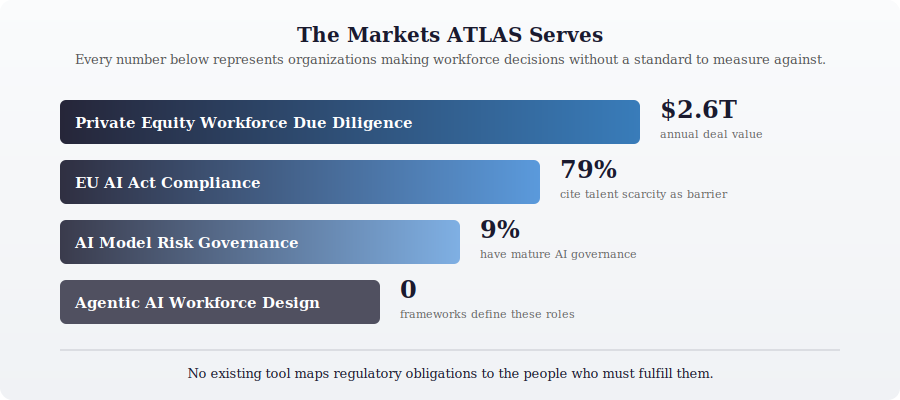
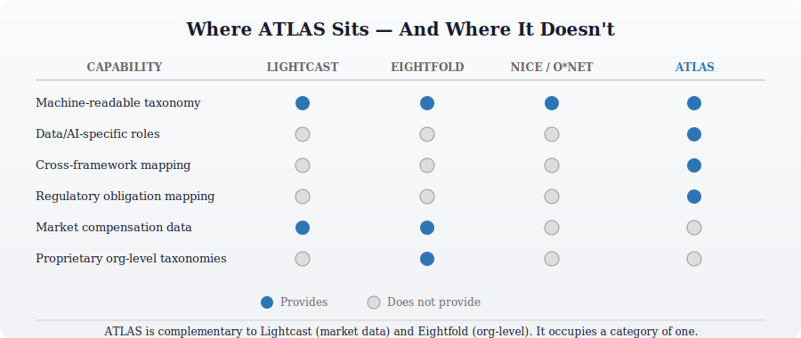

  

# ATLAS

**The first machine-readable, cross-framework workforce taxonomy for data and AI.**

ATLAS answers a question that every organization building with data and AI eventually faces but nobody has standardized: *who do we need, what should they know, and how do we measure the gap between where we are and where we need to be?*

There are frameworks that describe cybersecurity roles. Frameworks that describe general occupations. Frameworks that describe IT skills. None of them were built for the data and AI profession — the discipline that now underpins every enterprise strategy but has no shared language for its workforce.

ATLAS fills that gap. It defines 187 roles across the full data and AI organization, maps 363 knowledge, skills, and abilities across 12 knowledge domains using a shared-pool model, and unifies 70+ source frameworks — NIST NICE, O\*NET, SFIA, DAMA DMBOK, ESCO, EU AI Act, ISO 42001, SR 11-7, and dozens more — into a single dataset with full source provenance. Every mapping traces back to where it came from. Every role carries context from every framework that describes it.

The result: one taxonomy that speaks every framework's language simultaneously.

---

## The Problem Worth Solving

Organizations are making consequential workforce decisions — hiring, restructuring, assessing regulatory readiness, evaluating acquisition targets — using frameworks that were never designed for data and AI. They translate between NICE and O\*NET and SFIA manually. They map regulatory obligations to roles on whiteboards. They assess team capability against standards that exist only in someone's head.

This is not a tooling gap. It is an infrastructure gap. The same infrastructure gap that O\*NET solved for the general labor market forty years ago, that NICE solved for cybersecurity a decade ago. Data and AI is the last major professional domain without a machine-readable workforce standard.

  

---

## What ATLAS Makes Possible

**For PE operating partners evaluating acquisition targets:** A standardized assessment that maps the target's data/AI team against a reference taxonomy, produces a maturity score, identifies key-person risks, and models the Year 1–3 workforce investment. Delivered in 30 days, priced as deal-level trivial. No more gut feel and reference checks for the workforce that will determine whether the value creation plan succeeds.

**For organizations navigating the EU AI Act:** A mapping between regulatory obligations and the people who must fulfill them — across EU AI Act, NIST AI RMF, and ISO 42001 simultaneously. Not a compliance workflow tool. A workforce blueprint that tells you which roles satisfy which obligations, and which two hires cover the most regulatory surface area if your budget is limited.

**For financial institutions governing AI models:** An organizational design framework for SR 11-7 model risk governance adapted for AI. Three lines of defense mapped to defined roles with independence requirements, staffing ratios, and cross-regulatory context. The reference architecture that consulting firms haven't published.

**For anyone building with agentic AI:** The first structured role definitions for a workforce category that doesn't exist in any established framework. Agent Supervisor, Agent Orchestrator, AI Trust Engineer — roles that organizations are creating ad hoc, without a shared vocabulary. ATLAS provides the vocabulary.

**For newly hired CDIAOs walking into a role on Monday:** A Week 1 assessment that maps the current team, identifies the three biggest gaps, and produces a hiring plan by end of Week 2. Not a 187-role taxonomy to study. A tool that produces answers on the timeline the operating partner expects.

---

## The Differentiator Nobody Else Can Provide

  

Lightcast processes billions of job postings and has compensation data updated biweekly. Eightfold builds proprietary organizational taxonomies for individual enterprises. NICE defines cybersecurity roles. O\*NET covers the general labor market. Each is excellent at what it does. None of them do what ATLAS does.

ATLAS is the only dataset that maps a single role to obligations under multiple regulatory and professional frameworks simultaneously. An AI Governance Manager in ATLAS carries context from EU AI Act Article 14, NIST AI RMF GOVERN functions, ISO 42001 controls, DAMA DMBOK knowledge areas, and SFIA skills — all in one record, all with source provenance.

That cross-framework mapping is the feature a CISO with budget for two hires and three regulatory obligations needs. It is the feature a PE operating partner assessing a regulated target needs. It is the feature that makes ATLAS citable by analysts and usable by practitioners. And it is genuinely difficult to replicate, because it requires not just data access but two decades of judgment about how these frameworks relate to each other.

---

## Execution Roadmap

Every roadmap item has been scored on impact, overlooked probability, and dependency weight. The sequence is determined by structural dependencies — what must be true before the next thing can be built — not by which use case sounds most appealing in a strategy meeting.

  

The full roadmap contains 25 scored items organized into dependency tiers, each with documented rationale. Eleven Architectural Decision Records capture the reasoning behind every major decision — what was chosen, what was considered, and what the consequences are.

**Phase 0 — Validate (Weeks 1–2).** Completed 2026-03-26. Four parallel tests executed with results: R01 (Coverage Gap Test) PASS — 92.2% KSA coverage across 5 archetypes validates current data supports a pilot assessment. R02 (AI-Assisted KSA Quality Test) PASS — 4.26/5 average quality score validates AI-assisted authoring can match manual quality. R05 (License Audit) CONDITIONAL — 19 frameworks GREEN for commercial use, all others citation-only, establishes commercial pathway. R24 (Consistency Audit) PASS WITH CONDITIONS — 8.2/10 consistency score across existing KSAs establishes authoring standards. All assumptions validated. See detailed results: [`docs/roadmap/PHASE-0-VALIDATION-SPRINT-RESULTS.md`](docs/roadmap/PHASE-0-VALIDATION-SPRINT-RESULTS.md)

**Phase 1 — First Product (Weeks 3–8).** In progress. R04 (PE Assessment Methodology) complete. **Critical correction applied:** KSA data model restructured from role-centric to shared domain pool (ADR-013) after depth audit revealed 8.95 KSAs/role average versus NICE framework's 68-206 — a 14.9x shortfall. Architecture now uses 12 knowledge domains with many-to-many role mappings. KSA depth enrichment (40-80 per role) in progress. Pilot engagement (R03) blocked until enrichment completes. See [ADR-012](docs/roadmap/adr/ADR-012-ksa-depth-correction.md), [ADR-013](docs/roadmap/adr/ADR-013-shared-pool-ksa-architecture.md).

**Phase 2 — Compliance + Validation (Weeks 9–16).** EU AI Act obligation-to-role mapping ships before August 2026 enforcement. Cross-regulatory role coverage analysis produces the killer feature. Regulatory practitioners validate the mappings. The quick assessment interface makes the methodology repeatable.

**Phase 3 — Expand (Weeks 17–24).** Agentic AI role definitions. SR 11-7 organizational design patterns. CDAIO assessment toolkit. Built on the credibility established by a validated pilot and compliance market presence.

**Phase 4 — Scale (Weeks 25+).** API. Graph database. Full KSA coverage. Funded by Phases 1–3 revenue.

> Full roadmap analysis, scoring methodology, and all 11 ADRs: [`docs/roadmap/`](docs/roadmap/)

---

## Current State — Honest Assessment

ATLAS is in active development at version 0.4.3. Transparency about where things stand is not a weakness; it is the credibility this project is built on.

**What exists today:** 187 roles defined across 10 categories. 364 KSAs mapped. 70+ source frameworks with provenance. 333 role-to-framework mappings. Entity-separated architecture designed for graph database ingestion. Schema supporting regulatory context, cross-framework mapping, and quantified assessment.

**Phase 0 Validation: Complete.** The validation sprint has executed with all tests passing or passing-with-conditions. Coverage validation (R01) confirmed 92.2% KSA coverage across 5 archetypes, supporting mid-market team assessments. Quality validation (R02) confirmed AI-assisted authoring can match manual quality (4.26/5 average), reducing KSA completion timeline from 6–12 months to 4–8 weeks. License audit (R05) confirms that 19 GREEN frameworks permit commercial use without restriction; 28 additional frameworks require attribution; all 70 frameworks are citation-only at minimum. The hypothesis — that current coverage is sufficient for a PE assessment pilot — is validated with measurable evidence. Phase 1 (First Product) is cleared for execution.

**Phase 1 First Product: R04 complete, R08 complete.** The PE Workforce Due Diligence Assessment methodology is fully specified — a 4-dimension scoring model producing a single Workforce Readiness Score (0-100), a 30-day engagement workflow, four deliverable templates, and five reference architectures by company profile. Every score traces to observable evidence against ATLAS KSA requirements. R08 closed the remaining KSA gaps: 42 KSAs authored across 5 roles (Model Risk Manager, MLOps Engineer, DataOps Engineer, Data Protection Officer, Clinical Data Manager), bringing PE archetype coverage from 92.2% to 100%. Every role in every PE archetype now has full KSA-level assessment capability.

**Commercial viability confirmed for GREEN frameworks.** The commercial_status classification established in R05 produces a clean subset of 19 frameworks with unrestricted commercial application. The AI-assisted authoring pathway (validated by R02) enables rapid KSA expansion to additional roles as commercial features are prioritized. Provenance tagging ensures transparency about which KSAs were human-authored versus AI-assisted.

**What does not exist yet:** Full KSA coverage (42 of 187 roles have complete KSAs, but remaining scaffold-only roles can now be authored via the AI-assisted workflow validated by R02). Populated regulatory context fields (in progress for EU AI Act, Phase 2). A pilot engagement partner (R03). An API.

**What the research says:** The gap between current state and first product has been empirically validated. Results: [`docs/roadmap/PHASE-0-VALIDATION-SPRINT-RESULTS.md`](docs/roadmap/PHASE-0-VALIDATION-SPRINT-RESULTS.md)

---

## How Decisions Get Made

This project does not operate on intuition. The roadmap was produced through a structured five-pass analysis — Forward Decomposition, Reverse Induction, Perspective Rotation, Constraint Inversion, and Second-Order Mapping — applied against six priority use cases with parallel research across five domains. Each major decision is documented as an Architectural Decision Record with context, rationale, alternatives considered, and consequences.

| Decision | Record | Core Reasoning |
|----------|--------|----------------|
| Sequence by dependencies, not priority | [ADR-001](docs/roadmap/adr/ADR-001-dependency-driven-roadmap-sequencing.md) | Priority rankings create serialization traps. Dependencies reveal the natural build order. |
| PE due diligence as first product | [ADR-002](docs/roadmap/adr/ADR-002-pe-due-diligence-as-beachhead.md) | One PE firm adoption cascades to 8+ portfolio assessments. No other use case has this multiplier. |
| Ship on current data, don't wait | [ADR-003](docs/roadmap/adr/ADR-003-ship-on-current-data-coverage.md) | Every month spent completing the dataset before piloting is a month of deferred market validation. |
| EU AI Act as urgent parallel track | [ADR-004](docs/roadmap/adr/ADR-004-eu-ai-act-timeline-urgency.md) | August 2026 enforcement. Five months. The compliance window does not wait. |
| AI-assisted authoring with quality gates | [ADR-005](docs/roadmap/adr/ADR-005-ai-assisted-ksa-authoring.md) | 3–5x speedup, shifting the bottleneck from production to review. Contingent on quality validation. |
| Cross-regulatory mapping as differentiator | [ADR-006](docs/roadmap/adr/ADR-006-cross-regulatory-role-coverage.md) | One role satisfying multiple regulatory obligations is the feature nobody else provides. |
| Assessment service, not dataset product | [ADR-007](docs/roadmap/adr/ADR-007-product-positioning-assessment-service.md) | Every buyer persona buys answers, not data access. The taxonomy is cost of goods. |
| Schema modifications before enrichment | [ADR-008](docs/roadmap/adr/ADR-008-schema-modifications-before-enrichment.md) | Don't populate fields that will change. Modify the schema first. |
| Agentic AI as Tier 3 first-mover play | [ADR-009](docs/roadmap/adr/ADR-009-agentic-ai-roles-first-mover.md) | First-mover advantage is real but only holds if definitions are credible. Credibility comes from the beachhead. |
| Validate before building | [ADR-010](docs/roadmap/adr/ADR-010-validation-sprint-before-product-build.md) | Four tests executed: R01 PASS (92.2% coverage), R02 PASS (4.26/5 quality), R05 CONDITIONAL (19 GREEN frameworks), R24 PASS WITH CONDITIONS (8.2/10 consistency). Go decision for Phase 1 product build. |
| PE assessment scoring model design | [ADR-011](docs/roadmap/adr/ADR-011-pe-assessment-scoring-model.md) | Evidence-based scoring against ATLAS KSAs, deal-specific criticality, four deliverables without compensation data, reference architectures by company profile, single WRS composite score. |

---

## For Collaborators

ATLAS is built by [Thomas Jones](https://www.linkedin.com/in/yourprofilehere) — The Hipster CISO. Twenty years of executive leadership spanning cybersecurity, data governance, and AI strategy. Carnegie Mellon CDAIO Program. Building at the intersection of enterprise protection and enterprise growth, because those are the same discipline viewed from different altitudes.

The project welcomes collaborators who bring specific expertise the roadmap needs:

**Regulatory practitioners** — EU AI Act interpretation, SR 11-7 model risk governance, ISO 42001 implementation experience. The regulatory context mappings need validation by people who have been through examinations, not just people who have read the regulations.

**PE operating partners and portfolio advisors** — If you assess data/AI teams as part of deal diligence or portfolio management, you are the user ATLAS was designed to serve first. A pilot engagement produces value for both sides: you get a structured assessment methodology, ATLAS gets market validation.

**CDIAOs and CISOs in the first 90 days of a new role** — You are building the assessment and organizational design that ATLAS is being built to support. Your feedback on what's useful, what's missing, and what's wrong is more valuable than any framework analysis.

**Data and AI workforce researchers** — If you study role evolution, skills taxonomies, or organizational design for data/AI teams, ATLAS's dataset is available for research collaboration.

> Interested? Open an issue, or reach out directly through [The Hipster CISO](https://thehipsterciso.substack.com).

---

## Technical Documentation

The executive narrative above tells you why ATLAS exists and where it's going. The technical documentation tells you how it's built.

| Document | What It Covers |
|----------|----------------|
| [Architecture and Data Model](docs/TECHNICAL.md) | Entity-separated flat files, schema design, graph-ready structure, validation |
| [Master Schema Design](docs/master-schema-design.md) | 25+ field JSON schema with nested regulatory and framework context |
| [Field-by-Field Assessment](docs/field-by-field-assessment.md) | Use case analysis and modification verdicts for every schema field |
| [Gap Analysis](docs/gap-analysis.md) | 187-role inventory with coverage status against source frameworks |
| [Roadmap Analysis](docs/roadmap/ensemble-brainstorm-atlas.md) | Full five-pass strategic analysis with research citations |
| [Architectural Decision Records](docs/roadmap/adr/) | 11 ADRs documenting rationale for every major roadmap decision |
| [PE Assessment Methodology](methodology/R04-pe-assessment-methodology.md) | Scoring model, engagement workflow, and deliverable specifications for the PE workforce due diligence product |
| [NICE Boundary Scoping](docs/nice-boundary-scoping.md) | How ATLAS relates to NIST NICE for cybersecurity boundary roles |

---

  Version 0.4.3 · Copyright 2026 Thomas Jones · All rights reserved

