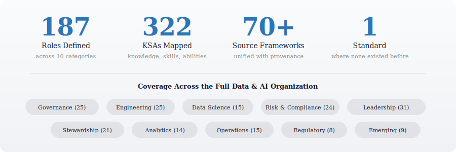
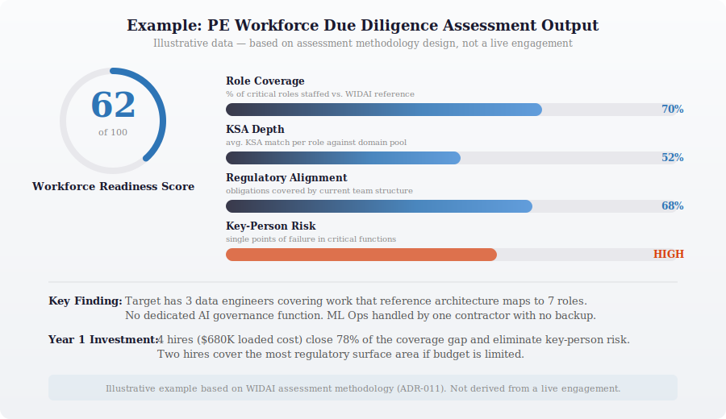

  

# WIDAI — Workforce Initiative for Data and AI

**The first machine-readable, cross-framework workforce taxonomy built specifically for data and AI.**

The labor market has had O\*NET for forty years. Cybersecurity has had NICE for a decade. Data and AI — the function that boards are betting their competitive future on — has nothing. No shared language for its workforce. No standard for who these people are, what they should know, or how to measure the gap between where an organization is and where it needs to be.

WIDAI fills that gap. 187 roles. 692 KSAs across 12 knowledge domains. 70+ source frameworks unified with full provenance. Every mapping computationally scored and independently validated — not expert opinion, not manual classification. 536,737 rationale files across 2.76 million scored pairs. One taxonomy that speaks every framework's language simultaneously.

---

## What This Makes Possible

  

**PE Workforce Due Diligence.** Map an acquisition target's data/AI team against a reference taxonomy. Produce a composite Workforce Readiness Score, identify key-person risks, model the Year 1–3 workforce investment — delivered in 30 days. One PE firm adoption cascades to assessments across every portfolio company.

**EU AI Act Compliance.** Enforcement begins August 2026. Organizations deploying high-risk AI need to demonstrate competencies they cannot currently map. WIDAI connects regulatory obligations to the people who must fulfill them — across EU AI Act, NIST AI RMF, and ISO 42001 simultaneously.

**AI Model Risk Governance.** SR 11-7 three lines of defense with defined roles, staffing ratios, cross-regulatory context. The organizational design reference that does not exist in any published standard.

**CDAIO Week 1 Assessment.** New in the seat, operating partner expects a team assessment by Week 2. Map the current team, identify the three biggest gaps, produce the plan.

  

---

## Current State

Version 0.6.0. Six framework STRMs complete on the domain-exhaustive scoring pipeline:

| Framework | Elements | Scored Pairs | Mappings | Rationale Files |
|-----------|----------|-------------|----------|-----------------|
| O\*NET 30.2 | 126 | 34,763 | 5,440 | 5,440 |
| NIST NICE v2.1.0 | 2,148 | 1,082,592 | 181,750 | 181,750 |
| DoD DCWF v5.1 | 2,945 | 1,484,280 | 288,101 | 288,101 |
| UK DDaT | 189 | 95,256 | 28,837 | 28,837 |
| EU AI Act | 62 | 31,248 | 13,481 | 13,481 |
| NIST AI RMF 1.0 | 70 | 35,280 | 19,128 | 19,128 |
| **Total** | **5,540** | **2,763,419** | **536,737** | **536,737** |

Phase 0 validation confirmed: 92.2% KSA coverage across 5 PE archetypes, AI-assisted authoring quality at 4.26/5, 19 frameworks cleared for commercial use. The hypothesis is tested, not assumed.

**What does not exist yet:** Full role-KSA mappings at target depth, populated regulatory context fields, a pilot engagement partner, an API.

---

## Why This Doesn't Already Exist

  

Nobody else maps a single role to obligations under multiple regulatory and professional frameworks simultaneously — where an AI Governance Manager carries context from EU AI Act Article 14, NIST AI RMF GOVERN functions, ISO 42001 controls, DAMA DMBOK knowledge areas, and SFIA skills, all in one record, all with source provenance. That cross-framework mapping is the feature that does not exist anywhere else, and it requires the kind of judgment about how these frameworks relate to each other that only comes from having worked across them for two decades. That is the moat.

---

## Next Steps

**PE operating partners and board members** — A pilot engagement produces value for both sides. You get a structured assessment methodology backed by a reference taxonomy. WIDAI gets market validation.

**EU AI Act compliance leaders** — The workforce blueprint ships before August 2026 enforcement. If your organization is in scope, this does not exist anywhere else.

**CDIAOs and CISOs in the first 90 days** — Your feedback on what is useful, what is missing, and what is wrong is more valuable than any framework analysis.

> Interested? Open an issue, or reach out through [The Hipster CISO](https://thehipsterciso.substack.com).

---

## Documentation

| Document | What It Covers |
|----------|----------------|
| [Technical Architecture](docs/TECHNICAL.md) | Data model, schema design, entity-separated architecture |
| [Scoring Methodology](docs/scoring-methodology.md) | STRM pipeline, multi-method scoring, SCF calibration |
| [STRM Progress](docs/README.md) | Per-framework status, progress tracking, file structure |
| [PE Assessment Methodology](methodology/R04-pe-assessment-methodology.md) | Scoring model, engagement workflow, deliverable specs |
| [Roadmap and ADRs](docs/roadmap/) | Execution roadmap, 19 Architectural Decision Records |

---

## About

Built by [Thomas Jones](https://www.linkedin.com/in/yourprofilehere) — The Hipster CISO. Twenty years of executive leadership spanning cybersecurity, data governance, and AI strategy. Carnegie Mellon CDAIO Program. Security, data governance, and AI strategy are the same discipline viewed from different altitudes. That convergence is where this project lives.

> [The Hipster CISO on Substack](https://thehipsterciso.substack.com) · [GitHub](https://github.com/thehipsterciso)

---

  Version 0.6.0 · Copyright 2026 Thomas Jones · All rights reserved

