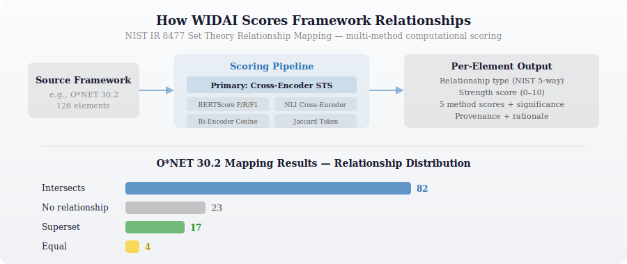

# STRM Scoring Methodology

WIDAI uses NIST IR 8477 Set Theory Relationship Mapping (STRM) as the formal methodology for mapping external frameworks against the KSA pool. Each framework element is scored computationally using a multi-method pipeline.

  

## Pipeline Architecture

A single consolidated script (`strm/strm_scoring_pipeline.py`) handles all frameworks via the `--strm` argument. Domain-exhaustive scoring — every element scored against every KSA in the 504-KSA pool through the full cross-encoder pipeline. No bi-encoder pre-filtering.

### Primary Method

Cross-Encoder Semantic Textual Similarity (STS) using `cross-encoder/stsb-roberta-base`. Processes both texts jointly through cross-attention — the current state of the art for semantic similarity in NLP research. Raw scores (0–1) map to a discrete SCF-aligned strength scale: 3, 5, 8, 10.

### Secondary Methods

Four independent validation signals accompany every scored pair:

- **BERTScore** (`roberta-large`) — Token-level contextual matching with Precision/Recall/F1 directionality. Reveals whether the relationship is symmetric or one-directional.
- **NLI Cross-Encoder** (`cross-encoder/nli-deberta-v3-base`) — Entailment, neutral, and contradiction probabilities. Serves as a contradiction gate: > 0.70 contradiction probability blocks Equal/Subset classification regardless of STS score.
- **Bi-Encoder Cosine** (`all-MiniLM-L6-v2`) — Independent embedding cosine similarity. Pre-encodes all KSA statements once, computes per-pair cosine from cached embeddings.
- **Jaccard Token Overlap** — Lexical baseline. Stopword-filtered token intersection over union.

### Classification Thresholds

SCF STRM-calibrated (derived from comparison against the Secure Controls Framework's published STRM):

| Relationship | STS Threshold | NLI Gate |
|-------------|---------------|----------|
| Equal | >= 0.82 | Contradiction <= 0.70 |
| Subset Of | >= 0.70 | Contradiction <= 0.70 |
| Intersects With | >= 0.35 | None |
| No Relationship | < 0.35 | — |

### Rationale Type

- **Semantic** — Competency frameworks (NICE, DCWF, DDaT, O*NET): direct concept-to-concept scoring
- **Functional** — Regulatory frameworks (EU AI Act, NIST AI RMF): obligation/outcome → competency mapping via `competency_implication` bridge text

## Memory Optimization

Sequential model loading with `gc.collect()` between phases prevents swap thrashing on memory-constrained systems. Each model is loaded, used, and freed before the next loads. NLI uses batch_size=32 (DeBERTa memory footprint); STS uses batch_size=128.

## Output Structure

Every scored pair that clears the Intersects With threshold produces:

- A row in `strm_mapping.json` with relationship type, strength, and raw STS score
- A rationale file in `rationale/` with all five method scores, classification reasoning, and framework-specific metadata

Elements where no KSA clears the threshold produce a No Relationship entry documenting the best candidate and its score.

## Scale

| Metric | Value |
|--------|-------|
| Frameworks scored | 6 |
| Total elements | 5,540 |
| Total pairs scored | 2,763,419 |
| Qualifying mappings | 536,737 |
| Rationale files | 536,737 |

Individual STRM results are documented in their respective ADRs and the per-framework `scoring_summary.json` files.
